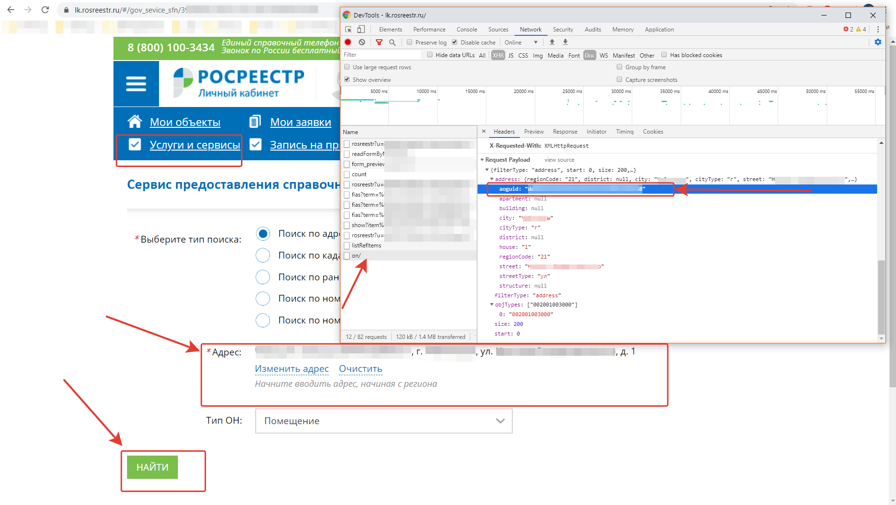

# getFromRosreestr
# Экспорт данных о зарегистрированных правах собственности из ЛК Россреестра

Бесплатно без СМС и без регистрации*.

* без ФИО собственника.

При проведении общего собрания собственников в соответствии с ЖК РФ Статья 45 П.3
Необходимо иметь реестр собственников помещений для уведомления собственников и проверки бюллетеней.
В интернете существует множество платных сервисов про приобретению полностью готового реестра собственников со всей требуемой для проведения информацией.

Т.к. в случае самостоятельного проведения собрания собственникам в любом случае приходиться проводить поквартирный обход.
Зачастую нет необходимости иметь полный реестр с колонкой "ФИО" собственника.

При поквартирном обходе собственники чаще всего положительно относятся к адекватной повестке дня и с удовольствием участвуют в голосовании но не могут найти выписку из ЕГРН.
именно в выписке из ЕГРН п.2.1 содержится тип собственности (частная / совместная /долевая) номер реестровой записи и дата регистрации.

Поэтому для экономии средств было достаточно скачать все реестровые номера номера из личного кабинета Росреестра.
ЛК Росреестра очень неудобен.
Но я обратил внимание на простоту и понятность JSON запросов вебморды в бэкенд.

# Выкладываю скрипты как они есть по выкачиванию ОТКРЫТЫХ данных из Росреестра:
## 1 Для работы скрипта необходим ключ для поля aoguid, вот процесс его получения:
Зайдите и авторизуйтесь с помощью Госуслуг на
https://lk.rosreestr.ru/#/services/
далее в "Услуги и сервисы"
далее "Сервис предоставления справочной информации по объектам недвижимости в режиме online"
Откройте отладчик браузера и посмотрите в запросе свой ключ:
Попробуйте в форме росреестра заполнить адрес воего дома и помещения, полученный пример запроса понадобится далее для заполнения массива запроса в скрипте.

## 2. Затем вставляем поисковые данные в скрипт *getFromRosreestr.php*
Шаг обхода номеров квартир и помещений:
``$stepStart = 0;
$stepStop = 100;``

Росреестр работает достаточно медленно поэтому шаг регулируйте по наитию :) 
Для примера в своём доме я дошёл с шагом по сто до 400.

`$data =` - масив запроса в какой доме какой тип помещений собственно ищем (помещение / квартира / кладовка / машиноместо и т.д.). 

Вызываем в браузере и или в командной строке скрипт *getFromRosreestr.php* необходимое количество раз 
 каждый  раз увеличиваем значения ``$step* ``
 
Все полученные ответы от Росреестра в виде JSON файлов *getFromRosreestr.php* положит рядом со скриптом.
 
 
## 3. Запускаем getCsvFromRosreestr.php 
Все полученные JSON конвертируются в CSV который потом можно импортировать в EXCEL и работать с реестром во благо своего дома!

